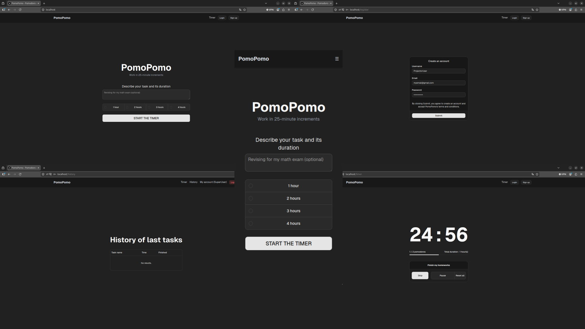

# Introduction
Ce projet est une application Web responsive permettant à n'importe quel utilisateur de gérer son temps de travail grâce à la méthode Pomodoro. L'utilisateur a aussi la possibilité de suivre l'évolution des différentes tâches effectuées.


Technologies utilisées :
- Spring Boot (Java)
- Maven
- Docker et Docker Compose
- Next.JS et React (TypeScript)
- JWT pour l'authentification
- Nginx en tant que reverse proxy
- PostgreSQL
- JUnit pour les tests unitaires
- Ansible
- Tailwind CSS
- Shadcn/ui

# Commandes 

### Lancer le projet (sans ansible)
```
cd services
docker compose up --build -d # Dev
docker compose -f docker-compose.prod.yml up --build -d # Prod
```
Bien attendre que Spring soit prêt.
Vous pouvez enlever l'argument -d pour voir les logs.

### Déployer avec Ansible
Modifier inventory.ini
```
monserveur ansible_host=192.168.0.29 ansible_user=vboxuser
```
Puis lancer
```
./launch.sh
```


### Pour accéder à l'application
```
https://localhost/
```

# Configuration du projet
### Variables d'environnement (mettre dans .env)
```
DB_URL=<URL vers la base de données> (ex : jdbc:postgresql://db:5432/mydb)
KEYSTORE_PASSWORD=<Mot de passe du keystore contenant le certificat TLS>
JWT_SECRET=<Clé secrète du JWT>
POSTGRES_DB=<Nom de la base de données>
POSTGRES_USER=<Nom d'utilisateur de la base de données>
POSTGRES_PASSWORD=<Mot de passe de la base de données>
NEXT_PUBLIC_URL=<Adresse du frontend>
```

### Keystore contenant le certificat TLS
Générer le keystore contenant le certificat TLS et le mettre dans backend/src/main/resources/keystore.p12

### Configuration de nginx
Modifier le fichier nginx/default.conf avec le nom de domaine en production.
Mettre le certificat TLS (fullchain.pem et privkey.pem) dans nginx/certs/.

### CORS
Modifier les fichiers précédents et ajouter le nom de domaine dans le fichier SecurityConfig.java pour autoriser le CORS.

# Aperçu
<div align="center">
    
</div>

